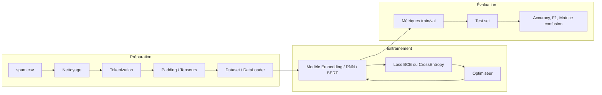

# Projet M07 — AT&T Spam Detector

Projet de détection automatique de SMS indésirables (spam) par deep learning, réalisé dans le cadre du module **M07 Deep Learning** (JEDHA Data Science). Ce dépôt contient l’énoncé du projet et la solution complète, structurée pour une présentation orale (logique, choix techniques, résultats).

---

## Objectif pédagogique

Construire un pipeline d’analyse prédictive sur des **données non structurées** (texte SMS) en utilisant les notions du module : préparation des données (tenseurs, augmentation), choix et entraînement d’un réseau de neurones, évaluation de la généralisation et pertinence des critères de performance.

---

## Dataset

- **Source** : [spam.csv](https://full-stack-bigdata-datasets.s3.eu-west-3.amazonaws.com/Deep+Learning/project/spam.csv)
- **Colonnes** : `v1` (étiquette : "spam" ou "ham"), `v2` (contenu du message).
- **Taille** : environ 5 500 SMS.
- **Répartition** : déséquilibre typique (beaucoup plus de ham que de spam) ; la solution gère ce déséquilibre via une répartition stratifiée et des métriques adaptées (F1, précision, rappel).

---

## Structure du dépôt

| Fichier | Rôle |
|--------|------|
| `01-AT&T_spam_detector.ipynb` | **Énoncé du projet** : contexte AT&T, objectifs, lien vers le dataset, conseils (start simple, transfer learning). |
| `02-AT&T_spam_detector_projet.ipynb` | **Solution complète** : préprocessing, augmentation, modèle, entraînement, évaluation sur test, conclusion. |
| `README.md` | Ce fichier : logique du projet, choix techniques, comment exécuter. |

---

## Logique du pipeline

Le flux global est le suivant :



1. **Chargement** : lecture du CSV (URL ou chemin local).
2. **Exploration** : dimensions, répartition des classes, longueur des messages, doublons, valeurs manquantes.
3. **Préparation** :
   - Nettoyage du texte (minuscules, ponctuation, espaces).
   - Encodage des labels (spam → 1, ham → 0).
   - Construction du vocabulaire à partir du corpus et tokenization (chaque SMS → séquence d’indices).
   - Padding/truncation pour une longueur fixe → **tenseurs** PyTorch.
   - **Augmentation de données** : technique adaptée au texte (ex. échange aléatoire de deux mots) pour enrichir le jeu d’entraînement.
   - Split **train / validation / test** (stratifié).
   - Création d’un `Dataset` PyTorch et de `DataLoader`s.
4. **Choix du modèle** : justification du type de réseau (embedding + pooling + FC) par rapport aux données (texte court, non structuré).
5. **Entraînement** : fonction de coût (Cross Entropy), optimiseur (Adam), boucle d’entraînement avec suivi loss et accuracy sur train et validation.
6. **Évaluation sur test** : accuracy, F1, précision, rappel, matrice de confusion pour vérifier la **généralisation**.

---

## Choix techniques

### Tokenization et représentation

- **Vocabulaire** construit sur le corpus (fréquence minimale pour limiter le bruit) ; token `<unk>` pour les mots inconnus, `<pad>` pour le padding.
- Chaque SMS est converti en **tenseur** d’entiers (indices) de longueur fixe (padding/truncation).
- **Embedding** appris de bout en bout : couche `nn.Embedding` qui transforme les indices en vecteurs denses, puis pooling (moyenne) pour obtenir une représentation fixe du message.

Alternative possible (non implémentée dans la version de base) : **transfer learning** avec un modèle pré-entraîné (ex. BERT, voir module D08) pour de meilleures performances au prix d’une complexité accrue.

### Fonction de coût et métriques

- **Classification binaire** → **Cross Entropy** (sortie logits sur 2 classes). C’est le critère usuel pour la performance en classification supervisée avec PyTorch.
- **Métriques** : accuracy, F1 (binaire), précision, rappel, **matrice de confusion**. Le F1 et la précision/rappel sont pertinents en cas de déséquilibre spam/ham.

### Gestion du déséquilibre

- Split **stratifié** pour conserver la proportion des classes dans train/val/test.
- Possibilité d’ajouter une **pondération des classes** dans la loss (`weight` dans `CrossEntropyLoss`) ou du **suréchantillonnage** des exemples spam si nécessaire.

### Augmentation de données

- Pour le **texte**, une technique simple et reproductible est utilisée : **échange aléatoire de deux mots** dans une fraction des exemples, ce qui génère des variantes sans changer le sens global et enrichit le jeu d’entraînement.

---

## Comment exécuter

### Environnement

- **Python** 3.8+.
- Dépendances : `torch`, `pandas`, `numpy`, `scikit-learn`, `matplotlib`.

Installation suggérée :

```bash
pip install torch pandas numpy scikit-learn matplotlib
```

### Données

- Le notebook charge le dataset directement depuis l’URL indiquée. Aucun téléchargement manuel n’est nécessaire si la machine a accès à Internet.
- En cas d’erreur d’encodage, le fichier `spam.csv` peut être enregistré localement en encodage `utf-8` ou `latin-1` et le chemin local peut être utilisé dans la variable `URL_DATASET`.

### Lancer le notebook

1. Ouvrir `02-AT&T_spam_detector_projet.ipynb` dans Jupyter ou VS Code.
2. Exécuter les cellules de haut en bas (Run All ou séquentiellement).

Les performances finales (accuracy, F1, etc.) s’affichent dans la section « Évaluation sur l’ensemble de test » et sont résumées en « Conclusion et performance ».

---

## Résultats

Après exécution du notebook, les **métriques sur l’ensemble de test** (accuracy, F1, précision, rappel, matrice de confusion) sont affichées dans la section dédiée. La conclusion du notebook résume la performance atteinte et les pistes d’amélioration (transfer learning, LSTM, plus de données).

Exemple de synthèse à mettre à jour après une exécution :

- **Modèle final** : accuracy test ~ X %, F1 ~ Y % (valeurs à remplacer par celles obtenues).

---

## Synthèse du contenu couvert

Le pipeline illustre notamment :

- **Préparation des données** : tenseurs (tokenization, padding), technique d’augmentation adaptée au texte.
- **Choix du type de réseau** : justification d’un réseau à embedding + couches denses pour des SMS non structurés.
- **Généralisation** : split train/validation/test, courbes d’entraînement, métriques sur le jeu de test.
- **Signaux issus du texte** : chaîne texte brut → nettoyage → indices → embedding.
- **Code** : structure lisible, conventions Python habituelles (PEP8 lorsque c’est applicable dans un notebook).
- **Critères de performance** : fonction de coût (Cross Entropy), métriques (accuracy, F1, précision, rappel, matrice de confusion).
- **Données textuelles** : nettoyage, doublons, vocabulaire, augmentation.
- **Chaîne prédictive** : de la donnée brute à la prédiction et à l’évaluation.

---

## Auteur et contexte

Projet réalisé dans le cadre de la formation Data Science (JEDHA). Le notebook `02-AT&T_spam_detector_projet.ipynb` peut être utilisé comme support pour la présentation orale devant le jury (logique, choix, résultats).
